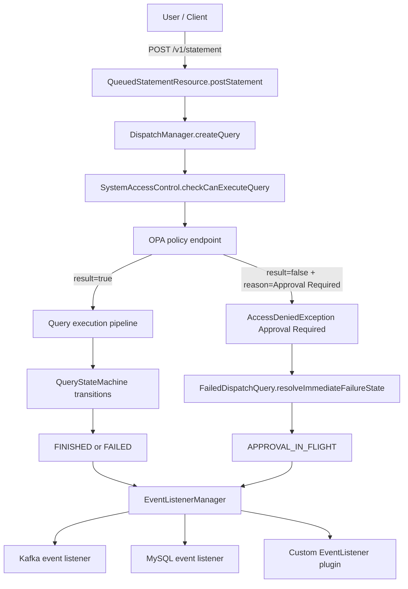

# Query Approval Workflow and Interceptors

This document provides a complete reference for the approval-required workflow:

- where query requests enter Trino
- where authorization is enforced before execution
- how query state is set to `APPROVAL_IN_FLIGHT`
- how query events are pushed to external systems (Kafka / MySQL / custom listeners)
- what changed in each source file

## 1. End-to-end architecture



## 2. Query entry point and pre-execution control

### Entry point for user query

1. `POST /v1/statement`
2. `QueuedStatementResource.postStatement(...)`
3. `QueuedStatementResource.registerQuery(...)`
4. `DispatchManager.createQuery(...)`

### Pre-execution control point

Authorization happens before execution starts:

- `DispatchManager.createQueryInternal(...)`
- `accessControl.checkCanExecuteQuery(identity, queryId)`

OPA integration is implemented in the OPA access control plugin and participates through this check.

## 3. State-machine behavior

States are defined in `QueryState`:

- normal flow: `QUEUED -> PLANNING -> RUNNING -> FINISHED`
- authorization denied: `FAILED`
- approval required denial: `APPROVAL_IN_FLIGHT`

Decision matrix:

| OPA result | OPA reason | Trino behavior | Final state |
|---|---|---|---|
| `true` | any/none | query continues | regular lifecycle (`FINISHED` or `FAILED`) |
| `false` | contains `Approval Required` | deny execution, mark approval pending | `APPROVAL_IN_FLIGHT` |
| `false` | missing/other | deny execution | `FAILED` |

Notes:

- The reason check is case-insensitive and uses `contains("approval required")`.
- `APPROVAL_IN_FLIGHT` is currently terminal in `QueryState`.

## 4. File-by-file changes

| File | Change | Purpose |
|---|---|---|
| `core/trino-main/src/main/java/io/trino/execution/QueryState.java` | Added `APPROVAL_IN_FLIGHT(true)` | Adds explicit query state for approval pending |
| `core/trino-main/src/main/java/io/trino/dispatcher/FailedDispatchQuery.java` | Added immediate-failure state resolver based on throwable message; listener now emits actual state | Maps `Approval Required` denials to `APPROVAL_IN_FLIGHT` instead of `FAILED` |
| `core/trino-main/src/main/java/io/trino/dispatcher/QueuedStatementResource.java` | Uses live query state from `dispatchManager.getQueryInfo(queryId).getState()` in queued results | Ensures `/v1/statement` status reports `APPROVAL_IN_FLIGHT` correctly |
| `plugin/trino-opa/src/main/java/io/trino/plugin/opa/schema/OpaQueryResult.java` | Added top-level `reason` field (`@JsonProperty("reason")`) | Decodes approval requirement reason from OPA response |
| `plugin/trino-opa/src/main/java/io/trino/plugin/opa/OpaHighLevelClient.java` | Added `queryOpaResult(...)`; deny path checks reason and throws `AccessDeniedException("Approval Required")` | Propagates OPA approval-required signal to dispatcher layer |
| `plugin/trino-opa/src/test/java/io/trino/plugin/opa/TestOpaAccessControl.java` | Added test for deny response with `reason: Approval Required` | Verifies OPA plugin emits expected denial message |
| `plugin/trino-opa/src/test/java/io/trino/plugin/opa/TestOpaResponseDecoding.java` | Added response decoding test for `reason` | Verifies schema decode compatibility |
| `core/trino-main/src/test/java/io/trino/dispatcher/TestFailedDispatchQuery.java` | New tests for `APPROVAL_IN_FLIGHT` vs normal `FAILED` | Verifies failure-state mapping logic |
| `docs/src/main/sphinx/security/opa-access-control.md` | Added docs for optional OPA `reason` support and approval state behavior | Documents new OPA response contract |
| `docs/query-lifecycle-interceptors/README.md` | Lifecycle and integration summary | Quick-start operational guide |
| `docs/query-lifecycle-interceptors/query-approval-workflow.md` | New detailed architecture and integration document | Full implementation and operations reference |

## 5. OPA integration details

### Trino configuration

`etc/access-control.properties`:

```properties
access-control.name=opa
opa.policy.uri=https://opa.example.com/v1/data/trino/allow
```

### OPA response contract (for ExecuteQuery)

Allow:

```json
{
  "decision_id": "abc-123",
  "result": true
}
```

Deny:

```json
{
  "decision_id": "abc-124",
  "result": false
}
```

Approval required:

```json
{
  "decision_id": "abc-125",
  "result": false,
  "reason": "Approval Required"
}
```

Important:

- Trino expects `result` as a boolean.
- `reason` is optional and read from the top-level response payload.
- If your OPA deployment only returns standard decision output without this top-level `reason`, add an OPA-side adapter/proxy to include it.

### Example Rego snippet

```rego
package trino

default allow := false

# Approval gate example for ExecuteQuery
allow if {
  input.action.operation == "ExecuteQuery"
  input.context.identity.user == "data_admin"
}

reason := "Approval Required" if {
  input.action.operation == "ExecuteQuery"
  input.context.identity.user != "data_admin"
}
```

If your policy returns `allow = false` and `reason = "Approval Required"`, the query is denied for execution and marked as `APPROVAL_IN_FLIGHT`.

## 6. External integration: Kafka and database

You do not need new core code to publish query events externally. Use event listeners.

### Kafka event listener

`etc/kafka-event-listener.properties`:

```properties
event-listener.name=kafka
kafka-event-listener.broker-endpoints=kafka.example.com:9093
kafka-event-listener.created-event.topic=query_create
kafka-event-listener.completed-event.topic=query_complete
kafka-event-listener.client-id=trino-approval-flow
```

`etc/config.properties`:

```properties
event-listener.config-files=etc/kafka-event-listener.properties
```

Kafka payload wrapper shape (from plugin model):

```json
{
  "eventPayload": {
    "metadata": {
      "queryId": "20260422_000000_00000_test1",
      "queryState": "APPROVAL_IN_FLIGHT"
    }
  },
  "eventMetadata": {
    "CLUSTER_ID": "prod-trino"
  }
}
```

### MySQL event listener

`etc/mysql-event-listener.properties`:

```properties
event-listener.name=mysql
mysql-event-listener.db.url=jdbc:mysql://example.net:3306/trino_events?user=trino&password=secret
```

`etc/config.properties`:

```properties
event-listener.config-files=etc/mysql-event-listener.properties
```

The listener writes into `trino_queries`, including `query_state`.  
Example lookup:

```sql
SELECT query_id, user, query_state, query, failure_message
FROM trino_queries
WHERE query_state = 'APPROVAL_IN_FLIGHT'
ORDER BY query_id DESC;
```

### Use Kafka and MySQL together

```properties
event-listener.config-files=etc/kafka-event-listener.properties,etc/mysql-event-listener.properties
```

## 7. Adding another interceptor

Choose interceptor type by intent:

1. Authorization interceptor (can block execution):
   - Implement `SystemAccessControl` and use `checkCanExecuteQuery(...)`.
2. Event interceptor (observability / external sinks):
   - Implement `EventListener` (`queryCreated`, `queryCompleted`).
3. Internal per-state transition interceptor:
   - Requires core patch around `QueryStateMachine.addStateChangeListener(...)` (no external SPI today).

Minimal custom event listener skeleton:

```java
public final class ExternalSinkEventListener implements EventListener
{
    @Override
    public void queryCreated(QueryCreatedEvent event)
    {
        // publish to Kafka / DB / HTTP sink
    }

    @Override
    public void queryCompleted(QueryCompletedEvent event)
    {
        String state = event.getMetadata().getQueryState();
        // state includes APPROVAL_IN_FLIGHT when approval is required
    }
}
```

## 8. Operational checklist

1. Configure OPA plugin and validate `ExecuteQuery` decisions.
2. Confirm OPA returns `reason: "Approval Required"` for approval-gated users.
3. Verify `/v1/statement` status shows `APPROVAL_IN_FLIGHT`.
4. Enable Kafka and/or MySQL listener in `event-listener.config-files`.
5. Verify external sink receives completed event with `queryState=APPROVAL_IN_FLIGHT`.
